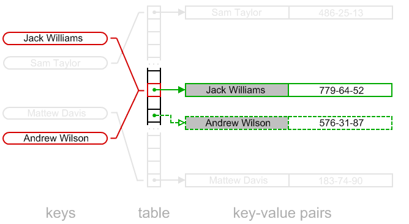
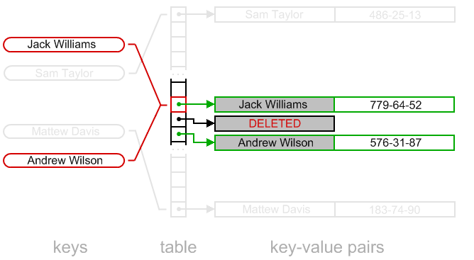

#Реализация алгоритма HashMap

1. Напишите простую, эффективную по памяти, реализацию алгоритма HashMap с открытой адресацией, для ключей типа int и значений типа long.
2. Для упрощения размер внутренней хеш-таблицы может быть фиксированным.
3. Реализуйте операции put, get, size.
4. Протестируйте правильность работы с помощью соответствующих Unit Tests.

* [Стратегия открытой адресации (линейного зондирования)](http://www.algolist.net/Data_structures/Hash_table/Open_addressing) **(** [www.algolist.net/Data_structures/Hash_table/Simple_example](http://www.algolist.net/Data_structures/Hash_table/Simple_example) **)**

